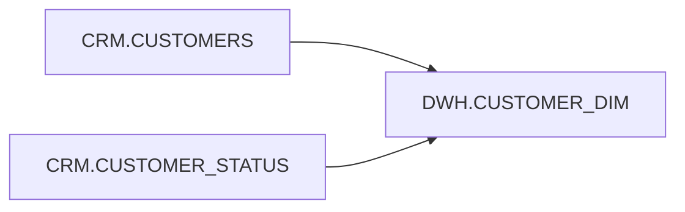

# ora-impact

A small Oracle SQL **impact-analysis tool** that shows which database objects a SQL script reads from and writes to.

> **Oracle compatibility**
>
> | Oracle version | Support |
> |---|---|
> | Oracle Database 19c | ✅ Supported for static SQL impact analysis |
> | Oracle Database 23ai | ✅ Supported for static SQL impact analysis |
> | Oracle AI Database 26ai | ✅ Supported for static SQL impact analysis |
>
> The current release performs **offline static analysis**. It does not require an Oracle connection and therefore does not depend on server-side catalog differences between 19c, 23ai and 26ai.
>
> **Important:** dynamic SQL, synonyms, editioning views and runtime-resolved object names cannot be resolved reliably without database metadata. When future features depend on a specific Oracle release, that limitation will be documented here before the feature documentation.

## What it does

Given SQL such as:

```sql
INSERT INTO dwh.customer_dim (customer_id, customer_name)
SELECT c.customer_id, c.customer_name
FROM crm.customers c
JOIN crm.customer_status s
  ON s.customer_id = c.customer_id
WHERE s.active_flag = 'Y';
```

`ora-impact` reports:

```text
Operations : INSERT
Reads      : CRM.CUSTOMERS, CRM.CUSTOMER_STATUS
Writes     : DWH.CUSTOMER_DIM
```

It can also emit JSON or a Mermaid dependency graph.

## Why it is useful

Before changing a query, ETL step or deployment script, developers often need a fast answer to:

- Which objects does this script depend on?
- Which objects can this script modify?
- What should I review before changing a source table?
- Can I generate a dependency diagram without connecting to the database?

`ora-impact` is intentionally small: it gives a quick first-pass impact view, not a false promise of full semantic dependency resolution.

## Installation

### From GitHub

```bash
python -m pip install "git+https://github.com/raoulmunet/ora-impact.git"
```

### Local development

```bash
git clone https://github.com/raoulmunet/ora-impact.git
cd ora-impact
python -m pip install -e ".[dev]"
pytest
```

## Usage

Analyze a file:

```bash
ora-impact examples/customer_dim.sql
```

Read SQL from standard input:

```bash
cat examples/customer_dim.sql | ora-impact -
```

JSON output:

```bash
ora-impact examples/customer_dim.sql --format json
```

Mermaid output:

```bash
ora-impact examples/customer_dim.sql --format mermaid
```

Save the Mermaid graph:

```bash
ora-impact examples/customer_dim.sql --format mermaid > impact.mmd
```

## Example output

### Text

```text
Statements : 1
Operations : INSERT
Reads      : CRM.CUSTOMERS, CRM.CUSTOMER_STATUS
Writes     : DWH.CUSTOMER_DIM
```

### JSON

```json
{
  "statement_count": 1,
  "operations": ["INSERT"],
  "read_objects": ["CRM.CUSTOMERS", "CRM.CUSTOMER_STATUS"],
  "write_objects": ["DWH.CUSTOMER_DIM"]
}
```

### Mermaid



## Python API

```python
from ora_impact import build_report

report = build_report("""
UPDATE dwh.customer_dim d
SET d.status = 'INACTIVE'
WHERE d.customer_id IN (
    SELECT c.customer_id
    FROM crm.customers c
);
""")

print(report.write_objects)
print(report.read_objects)
```

## What ora-impact currently detects

- objects read through `FROM`
- objects read through `JOIN`
- objects used by common `MERGE ... USING` forms
- objects written through `INSERT INTO`
- objects written through `UPDATE`
- objects written through `DELETE FROM`
- objects written through `MERGE INTO`
- objects affected by `TRUNCATE TABLE`

## Known limitations

Static SQL analysis has boundaries. Current limitations include:

- dynamic SQL such as `EXECUTE IMMEDIATE`;
- table names assembled from variables;
- synonym resolution;
- database links and remote metadata validation;
- semantic expansion of views;
- full PL/SQL package dependency analysis;
- column-level lineage.

Those are intentionally not guessed. Column-level lineage belongs in the companion **ora-lineage** project.

## Relationship to ora-core

This project uses [ora-core](https://github.com/raoulmunet/ora-core) for shared Oracle-aware static-analysis primitives. Keeping the parser foundation separate prevents every tool in the suite from implementing slightly different SQL parsing rules.

## Roadmap

- richer CTE handling;
- optional PL/SQL static dependency scanning;
- directory/batch analysis;
- interactive HTML graph;
- database-metadata enrichment mode;
- CI-friendly impact reports.

## License

MIT. See [LICENSE](LICENSE).
